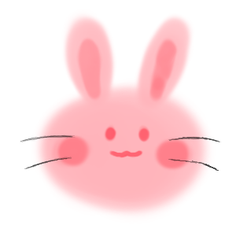

# 섹스 신청서 Frontend 

---

---

[어플리케이션 링크](https://sex-request.github.io/frontend/)  
[스토리북 링크](https://sex-request-storybook.netlify.app/)

---

위 이미지에 영감을 얻어 제작하게 되었습니다.

## 프로젝트 원칙

- 연령 제한 : 12세 이상
- 성별은 사용하지 않는다.
- 여러 성향을 존중한다.

## 참고사항

- 본 프로젝트는 "한글로 TypeScript 코딩을 하면 무슨 문제가 생길까?" 의 궁금증을 해결하기 위해 한글로 코딩합니다.
